## Spatial Data Science (GIS6307/GEO4930)

---

# Tutorial for Twitter Developer Account Activation

This tutorial provides instruction to sign up an Twitter Developer account, which allows you to access Twitter data from the APIs.

### `You need to activate your the Developer account by 4/18 before the Twitter workshop`

 
Instructor: Yi Qiang (qiangy@usf.edu) 
Teaching Assistant: Jinwen Xu (jinwenxu@usf.edu)

## 1. Step 1: Register an Twitter Account
1.1 Go to the website of Twitter Developer Platform: [developer.twitter.com](developer.twitter.com). Click `Sign-up`.

1.2 If you already have an Twitter account, sign in your Twitter account, and move to **Step 2: Activate Developer Account**. If you don't have an Twitter account, please sign up a Twitter account. **Please register using your phone number.**

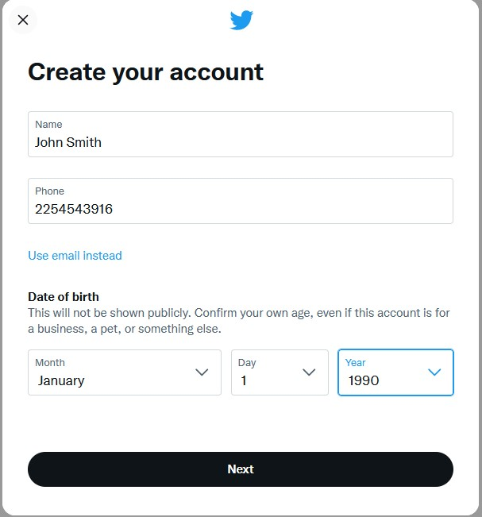

1.3 Click `Next` and enter the verification code when asked.

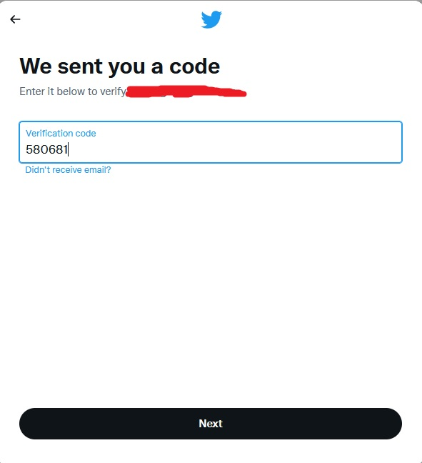

1.4 Create a password for your Twitter account. Skip `Pick a profile picture`, `Describe yourself`.  Create a username.

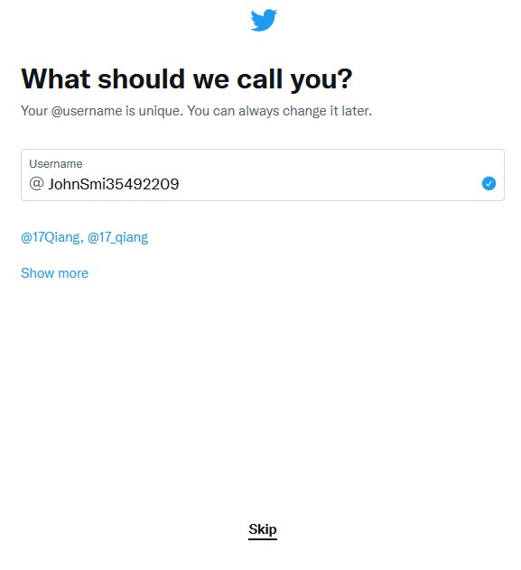

1.5 Skip `Turn on notification`, select some topics you want to see on Twitter, and choose some Twitter account to follow. Your registration is completed when you see your Twitter home page.

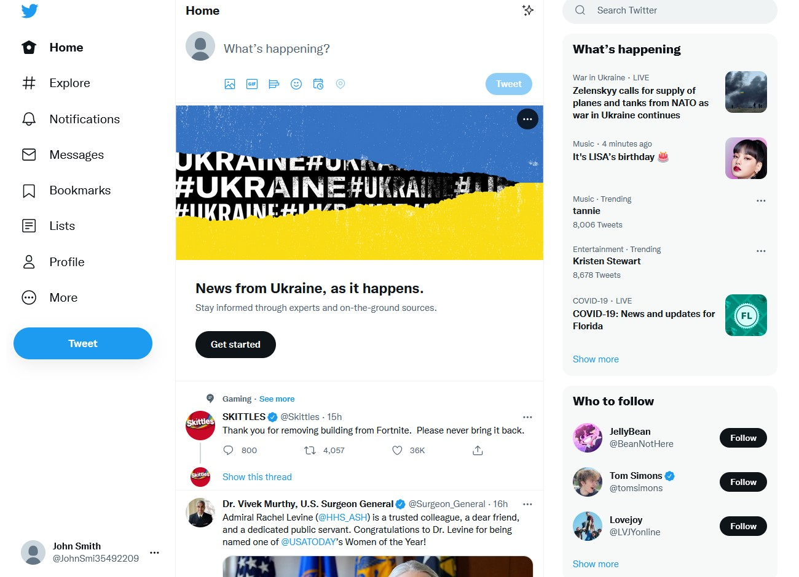

## Step 2: Activate Developer Account

2.1 When you have signed in the Developer Portal using your Twitter account, you'll need to answer a few questions to get the Essential access. Please select 'No' for "Will you make Twitter content or derived information available to a government entity or a government affiliated entity?".

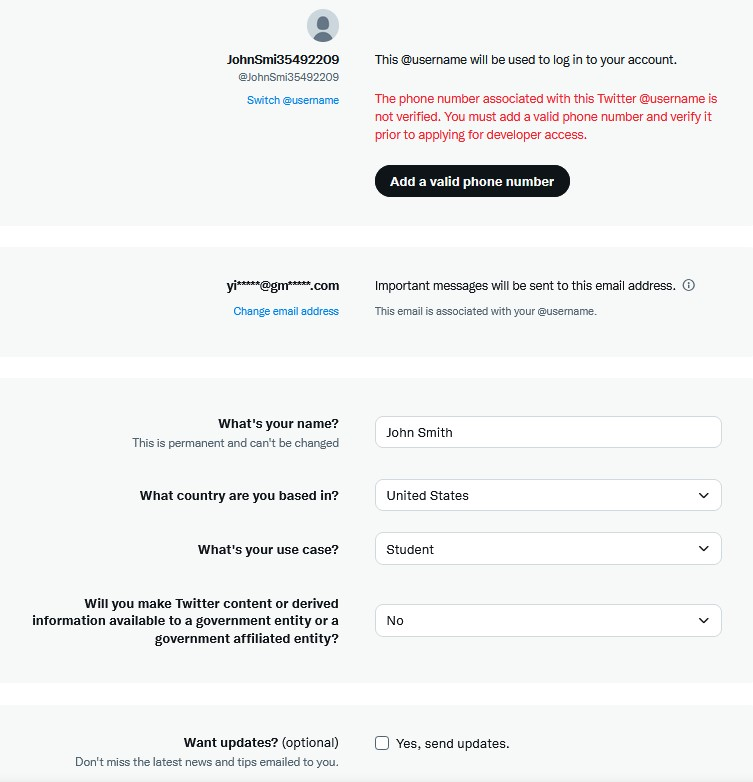

2.2 You need to add a phone number to your Twitter account if you haven't done it before. Enter the verification code to verify your phone number. When your phone is added, go back to the basic questions.

  You may need to refresh the webpage after adding the phone number.

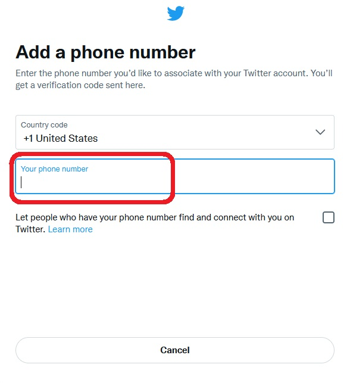

2.3 Agree the "Developer agreement & policy" and click `Submit`.

  Verify the email in your registered email account.

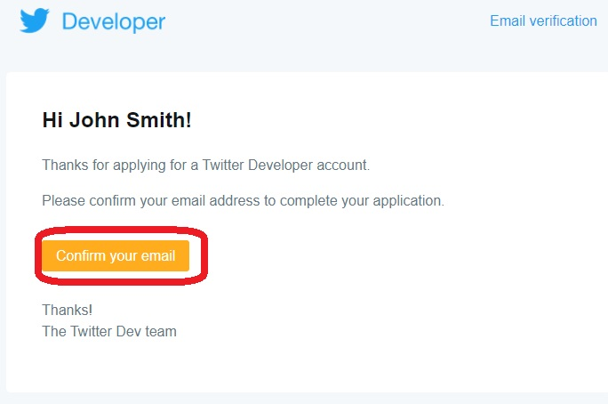

2.4 Enter a name for your application, e.g. GIS6017. Then click `Get keys`.

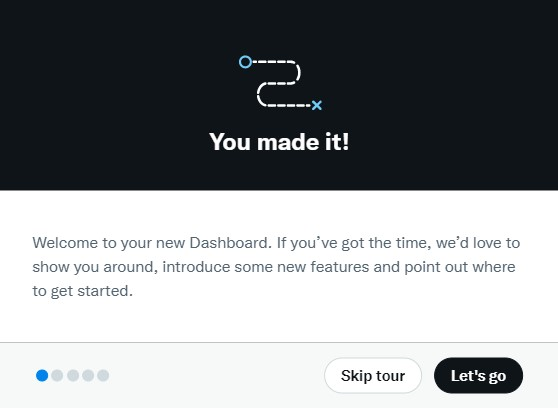

2.5 Now, your API keys and tokens are generated. These keys are like password for your Python program to access your Twitter account. Please save the **API key, API Key Secrete and Bearer Token** in an text file or Word document, and keep it secret. Don't worry if you lost them. You can always re-generate them in your Developer Portal.

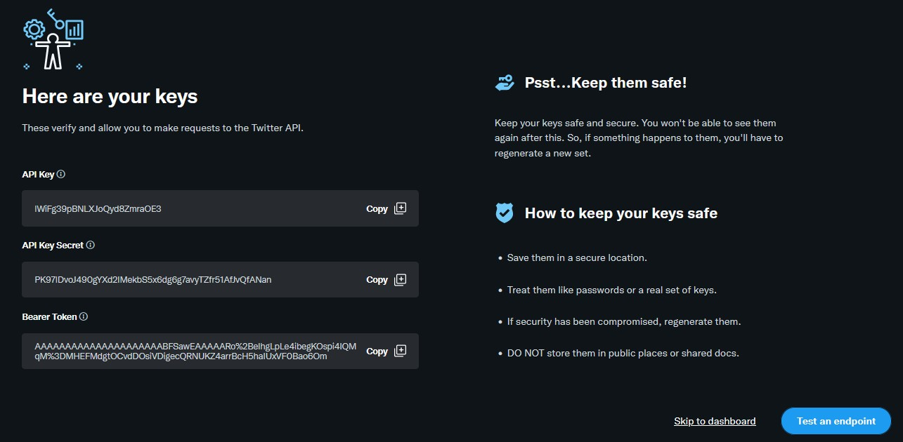

After you have saved the API keys and tokens, click `Test an endpoint`.

2.6 Test an endpoint.
Click an sample Tweet in the left, and then copy and paste the request in the right to a text pad.

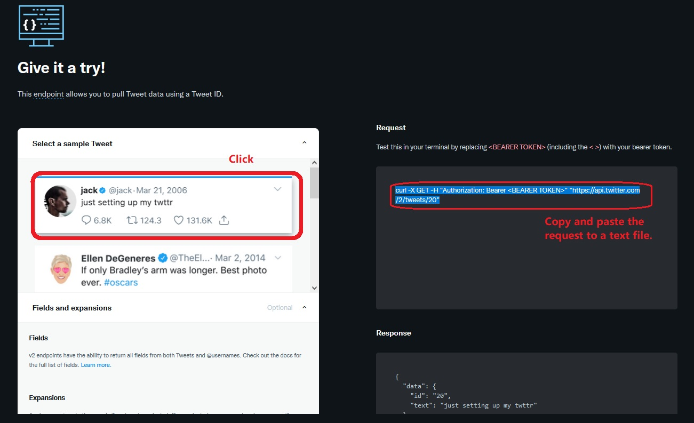

Replace `<BEAR TOKEN>` with the bear token you have saved (You can copy and paste to replace it).

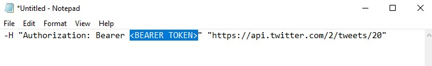

Then, copy the request with replaced Bearer Token, and paste it to Anaconda Prompt. Press `Enter` in your keyboard

Your Developer account is successfully activated if you see the sample Tweet text appears in the Prompt.

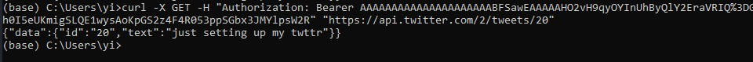

2.8 If you lost your API keys and tokens, you can re-generate them in the Developer Portal, under `Projects & Apps`.

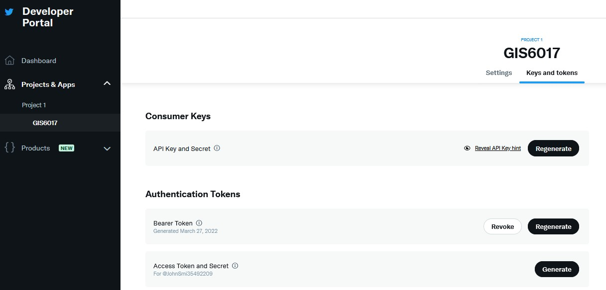
