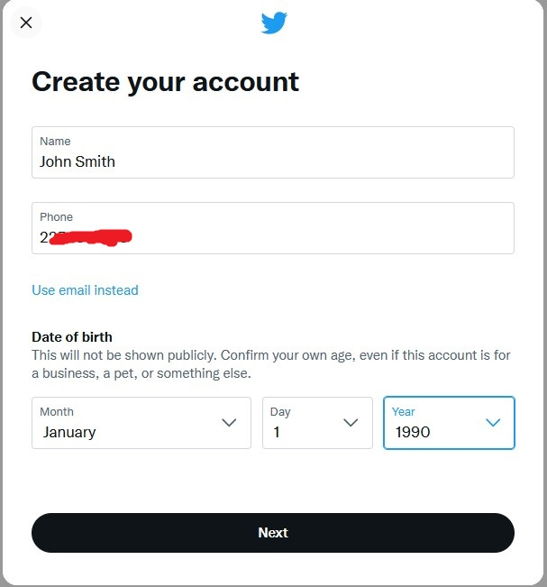
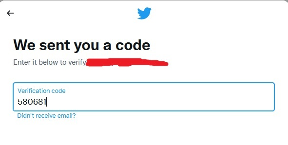
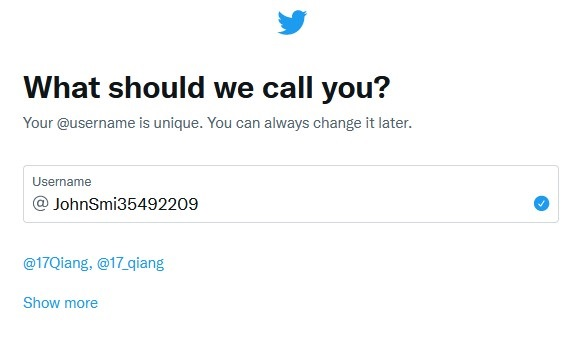

<body style="background-color:grey;">

## Spatial Data Science (GIS6307/GEO4930)

---

# Tutorial for Twitter Developer Account Activation

This tutorial provides instruction to sign up an Twitter Developer account, which allows you to access Twitter data from the APIs.

### `Please activate your Developer account by 4/15 to get it approved in time for the Twitter workshop`

 
Instructor: Yi Qiang (qiangy@usf.edu) 
Teaching Assistant: Jinwen Xu (jinwenxu@usf.edu)

## 1. Step 1: Register an Twitter Account
1.1 Go to the website of Twitter Developer Platform: [developer.twitter.com](https://developer.twitter.com).

1.2 If you already have an Twitter account, sign in your Twitter account, and move to **Step 2: Activate Developer Account**. If you don't have an Twitter account, please sign up a Twitter account. **Please register using your phone number.**

1.3 Click `Next` and enter the verification code when asked.

1.4 Create a password for your Twitter account. Skip `Pick a profile picture`, `Describe yourself`.  Create a username.

1.5 Skip `Turn on notification`, select some topics you want to see on Twitter, and choose some Twitter account to follow. Your registration is completed when you see your Twitter home page.

## Step 2: Activate Developer Account

2.1 When you have signed in the Developer Portal using your Twitter account, you'll need to answer a few questions to get the Essential access. Please select 'No' for "Will you make Twitter content or derived information available to a government entity or a government affiliated entity?".

2.2 You need to add both a phone number and email to your account if you haven't. Enter the verification code to verify your phone number/email. When your phone/email is added, go back to the basic questions.

  You may need to refresh the webpage after adding the phone number/email.

2.3 Agree the "Developer agreement & policy" and click `Submit`.

  Verify the email in your registered email account.

2.4 Enter a name for your application, e.g. GIS6017. Then click `Get keys`.

2.5 Now, your API keys and tokens are generated. These keys are like password for your program to interact with the Twitter APIs. Please save the **API key and API Key Secrete** (we don't use Bearing Token) in a text file or Word document for later use. Don't worry if you lost them. You can always re-generate them in the Developer Portal.

After you have saved the API keys and tokens, click `Skip to dashboard`.

## Step 3. Activate Elevated Access
After completing Step 2, you have obtained the Essential Access in the Developer Portal. Next, you will apply for the Elevated Access to gain more advanced features of the Twitter APIs.

3.1 In the Developer Portal, click `Product` -> `Twitter API v2` -> `Elevated` -> `Apply for Elevated`. Fill Basic info and then click `Next`.

Write a few of sentences to describe how you plan to use Twitter data and/or APIs. You can modify the following description to claim you will study a topic of your interest (e.g. the topic could be any sport events, natural disasters, political events, or culture...). 3-4 sentences should be enough. Please do not submit the identical description. Twitter may detect it and ask more questions.

Choose `No` for all the following questions, and click `Next`. Click `Next` again in the Review page.

Agree the Developer agreement & policy and click `Submit.`

If you are lucky enough, your application will be approved immediately and you may see "You have Elevated access" in the Developer Portal.

Sometimes, you will see "Your application for Elevated access is pending".

Later, you'll receive an email from Twitter asking for more details. The following figure shows an example of the email. Just write a few sentences to answer the first two questions, and answer "not applicable" for the other questions. For the second question, you may say that "**I will create maps or conduct analysis of Tweets aggregated in countries/states/counties. I will not display or publish Tweets at individual/row level by any means**".

You may receive additional emails for your application. Just provide more to respond to their questions. Eventually, you will receive an email informing the approval of your Elevated Access.
